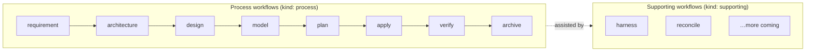

# 🪶 Sparrow

[](https://github.com/agiledon/sparrow/actions/workflows/ci.yml)
[](https://www.npmjs.com/package/sparrow-ddd)
[](LICENSE)

English | [简体中文](./README.zh-CN.md)


> Spec-driven DDD framework for AI coding assistants.
>
> The npm package is published as **`sparrow-ddd`**.

Sparrow transforms raw business requirements into production-ready code through a structured DDD process. Sparrow’s **core workflows** (every workflow skill defined in the schema and installed by `sparrow init`) comprise **process workflows** — the sequential eight-step pipeline — and **supporting workflows** — auxiliary commands like harness and reconcile that assist the pipeline at any time. It introduces the concept of **Interaction Context** — a first-class architecture concept parallel to Bounded Contexts that handles all frontend UI and BFF aggregation. Both backend BCs and the Interaction Context share the same standardized `design → model → plan → apply` workflow, yet remain completely orthogonal — no mutual dependencies, capable of parallel execution.

> 📜 Version history and highlights: see the [CHANGELOG](./CHANGELOG.md) and [GitHub Releases](https://github.com/agiledon/sparrow/releases).

## Why Sparrow?

- **No lock-in**: Works with Claude Code, OpenCode, Cursor, and Pi out of the box. Uses each tool's native AI — no CrewAI, LangChain, or other agent frameworks.
- **Spec-driven**: Every step produces concrete, version-controlled Markdown artifacts. You always know what was decided and why.
- **DDD-native**: Follows Domain-Driven Design principles end-to-end: business services → subdomains → bounded contexts → domain models → code.
- **Multi-language**: Supports Java, Python, Node.js/TypeScript, Go, Rust, and C++. Each bounded context can use a different tech stack.
- **Incremental & conversational**: Pause at any step, refine artifacts through dialog, then continue. Each skill reads the latest output from the previous step.

## Development Workflows

Sparrow’s **core workflows** are all bundled workflow skills (see schema `workflows`). Each skill has a `kind` field — `process` or `supporting` — that tells you how it fits into the overall DDD process:

| Category | `kind` | Role | When to run |
|----------|--------|------|-------------|
| **Process workflows** | `process` | The sequential DDD pipeline — from requirements to verified, archivable code | In order; product-level requirement/architecture once per change, team-level per context, product-level archive once to close |
| **Supporting workflows** | `supporting` | Auxiliary capabilities that assist the DDD process without replacing the pipeline | Anytime, independent of pipeline position |



### Process Workflows

The **process workflow** is Sparrow's main spec-driven DDD pipeline — eight ordered steps that transform raw requirements into production-ready code. Each process workflow skill reads artifacts from the previous step and writes version-controlled Markdown or code as output.

| Step | Command | Level | What it does |
|------|---------|-------|--------------|
| 1 | `/sparrow-requirement` | Product | Hierarchical exploration (SD→C→S→EBP→BS via Grill Me) + quality docs + [optional] UI operation flows from EBP |
| 2 | `/sparrow-architecture` | Product | Map subdomains to bounded contexts (1:1 then adjust) + thin spec slices with Properties + [if UI] frontend / Interaction Context |
| 3 | `/sparrow-design @{slug}` | Team | Define API contracts and tech stack for a bounded context or Interaction Context |
| 4 | `/sparrow-model @{slug}` | Team | Domain modeling (backend BC) or ViewModel + component modeling (Interaction Context) |
| 5 | `/sparrow-plan @{slug}` | Team | Devise implementation plan with task checklist |
| 6 | `/sparrow-apply @{slug}` | Team | Generate DDD-structured code (backend) or frontend + BFF code (Interaction Context) |
| 7 | `/sparrow-verify @{slug}` | Team | Verify code implementation against spec.md, api.md, tech.md, and model.md |
| 8 | `/sparrow-archive` | Product | Collect all slugs' delivery specs (not source code) and promote into `master/` for versioning |

**How process workflows run:**

- **Product-level** `requirement` and `architecture` (1–2) run **once** per change for the whole product — they establish shared requirements and architecture; architecture defines bounded contexts and the Interaction Context.
- **Team-level** steps (3–7) run **per slug** — once for each bounded context and Interaction Context. All contexts share the same commands and are fully orthogonal: no mutual dependencies, executable in any order or in parallel.
- **Product-level** `archive` (8) runs **once** per change after all team-level slugs complete — it collects every slug's delivery specs (not source code) and promotes them into `master/` for versioning.
- After any step, pause to review artifacts, refine through dialog, and re-run — the next step always reads the latest version.

**Spec layout**: Active work happens under `docs/sparrow/change/current/{change-id}/`; the published baseline lives in `docs/sparrow/master/` (populated after the first **archive promote**). `development-mode` (`tbd` | `greenfield` | `iteration` | `brownfield`) is stored in `.sparrow/sparrow-state.json`. Brownfield process pipeline is not supported yet. See [Output Structure](#output-structure).

See [Process Workflow Reference](#process-workflow-reference) below for inputs, outputs, and details of each step.

### Supporting Workflows

**Supporting workflows** are auxiliary commands that help you stay aligned with DDD discipline throughout the project lifecycle. They do **not** replace process pipeline steps and carry no ordering requirement — invoke them whenever the situation calls for it.

All supporting commands use the `sparrow-supporting-` prefix and the `kind: supporting` classification. More supporting workflows will be added over time to cover additional scenarios across the DDD development process (e.g. drift detection, migration assistance, cross-context consistency checks).

| Workflow | Command | What it does |
|----------|---------|--------------|
| **Harness** | `/sparrow-supporting-harness` | View, add, and maintain constraint assets — the project-level "must / must not" DDD rules that process workflow skills load before executing |
| **Reconcile** | `/sparrow-supporting-reconcile` | After vibe coding or bugfixes, reconcile **existing** spec docs and harness constraints with current code — without changing architecture or creating new spec files |

**Typical supporting workflow usage:**

- **Before or during process steps** — use **harness** to add project-specific constraints (coding standards, naming rules, integration policies) that every subsequent process workflow skill will enforce.
- **After ad-hoc changes** — use **reconcile** when code has drifted from specs (manual edits, quick fixes, exploratory coding) to bring documentation and constraints back in sync with reality.
- **After verify failures** — when P0/P1 issues trace back to spec drift rather than code bugs, reconcile first, then re-run verify.

## Installation

### From npm (recommended)

```bash
# Global install
npm install -g sparrow-ddd

# Or use without installing
npx sparrow-ddd init
```

### From local directory (development / offline)

If you have cloned the Sparrow repository locally, you can install directly from the local directory:

```bash
# Option 1: Use npm link (recommended for development)
cd /path/to/sparrow        # Navigate to the Sparrow project root
npm install                # Install dependencies
npm link                   # Link sparrow globally (runs source templates; no rebuild needed)

# Then use it from any directory
cd /path/to/your-project
sparrow init --tools claude

# To unlink
npm unlink -g sparrow-ddd
```

```bash
# Option 2: Install globally from local path (packs dist/; run build first)
npm run build
npm install -g /path/to/sparrow

# Option 3: Run the local build artifact directly
npm run build
node /path/to/sparrow/dist/sparrow.js init --tools claude
```

> **Note**: Local installation is primarily intended for developing and debugging the Sparrow framework itself. For everyday use, install the published version via npm.

**Requirements**: Node.js >= 18

## Quick Start

### 1. Initialize Sparrow in your project

```bash
cd your-project
sparrow init
```

Sparrow detects which AI tools you have installed and asks which to configure. You can also specify explicitly:

```bash
# Set up for Claude Code only
sparrow init --tools claude

# Set up for multiple tools
sparrow init --tools claude,opencode,cursor,pi

# Set up for all supported tools, no prompts
sparrow init --tools all --force

# Document language (BCP 47). Omit --lang to use the OS UI language; fallback zh-Hans
sparrow init --tools cursor --lang en
```

This creates skill and command files for each selected tool:

```
your-project/
├── .claude/
│   ├── skills/
│   │   ├── sparrow-requirement/
│   │   │   ├── SKILL.md
│   │   │   ├── references/
│   │   │   ├── assets/
│   │   │   └── scripts/
│   │   ├── sparrow-architecture/
│   │   ├── sparrow-design/
│   │   ├── sparrow-model/
│   │   ├── sparrow-plan/
│   │   ├── sparrow-apply/
│   │   ├── sparrow-verify/
│   │   ├── sparrow-archive/
│   │   ├── sparrow-supporting-harness/
│   │   └── sparrow-supporting-reconcile/
│   └── commands/sparrow/
│       ├── sparrow-requirement.md
│       ├── sparrow-architecture.md
│       └── ...
├── .opencode/          # (if OpenCode selected)
│   └── ...
├── .cursor/            # (if Cursor selected)
│   └── ...
├── .pi/                # (if Pi selected)
│   └── ...
├── docs/sparrow/
│   ├── master/              # Empty until archive promote
│   ├── change/
│   │   ├── current/         # Empty until a change-id is confirmed
│   │   └── archive/         # Empty until a change is archived
│   ├── harness/             # Project-level constraint placeholders
│   └── README.md
└── .sparrow/
    ├── sparrow-config.json  # Project tools / version / plugins
    └── sparrow-state.json   # change-id, development-mode, pipeline status
```

`sparrow init` also writes **global constraint assets** (including the `common/` tree) to the global config directory (`~/.config/sparrow/harness` on macOS/Linux, `%APPDATA%\sparrow\harness` on Windows).

After initialization, you can check for updates at any time:

```bash
sparrow update
```

This compares your local version against the npm registry and prompts you to upgrade if a newer version is available. It also syncs global constraint assets (creating or refreshing managed templates) whenever you run it.

### 3. Run the workflows

Invoke skills as slash commands in your AI tool. Sparrow’s core workflows split into two kinds — see [Development Workflows](#development-workflows):

- **Process workflows** — run the eight-step pipeline in order: `/sparrow-requirement` → `/sparrow-architecture` → `/sparrow-design @{slug}` → … → `/sparrow-verify @{slug}` → `/sparrow-archive`
- **Supporting workflows** — invoke anytime as needed: `/sparrow-supporting-harness`, `/sparrow-supporting-reconcile`

> **Important**: Product-level `requirement` and `architecture` (1–2) run once per change. Team-level process steps (3–7) run per slug — all contexts (backend BCs + Interaction Context) share the same commands and are fully orthogonal. Product-level `archive` (8) runs once per change after all slugs complete.

### 4. Iterate and refine

After any step, you can:
- Review the generated Markdown artifacts
- Discuss changes with the AI ("Update the subdomain classification...")
- Re-run the skill with modifications
- Continue to the next step — it always reads the latest version

## Process Workflow Reference

Detailed inputs, outputs, and behavior for each step in the [process workflows](#process-workflows).

### Step 1: sparrow-requirement (Product-level)

**Workspace**: `docs/sparrow/change/current/{change-id}/` (when no active change exists, this step creates `{change-id}` and writes `project.md` together with `proposal.md`)

**Input**: Raw requirements (`/sparrow-requirement @docs/prd.docx`); for **brownfield**, also the running system and codebase  
**Output** (under the change workspace):
- `requirement/business/catalog.md` — index + end-to-end business processes (EBP→BS); the only §1.2 link from `project.md`
- `requirement/business/{sd-slug}/[{c-slug}/]{s-slug}/` — nested problem-space specs (`subdomain.md`, optional `capability.md`, `scenario.md`, merged `business-services.md`; EARS acceptance on services)
- `requirement/quality/quality.md` — quality attributes (performance, security, availability, etc.)
- `requirement/ui/` — \[optional\] UI specs (operation flows ← EBP), design tokens, components, HTML prototypes

**Grill Me** follows problem-space layers then EBP coverage; optional UI converts EBP into end-to-end operation flows. For **iteration**, diff against `master/requirement/`. No `<!-- version -->` metadata blocks in the change workspace.

### Step 2: sparrow-architecture (Product-level)

**Input**: `requirement/business/` (catalog + nested `business-services.md`) + \[optional\] `requirement/ui/`; read-only `master/`  
**Output** (change workspace):
- `architecture/bounded-contexts.md` — SD→BC map, context map (no separate “business architecture” doc)
- `design/{slug}/spec.md` — thin BS projection + Properties (links back to `business-services.md#BS-{id}`)
- `architecture/frontend.md` — \[if UI\] Interaction Context, BFF, API binding tables

With UI, generates binding tables so BC and Interaction Context pipelines stay orthogonal. BC topology changes require user confirmation before **archive** (see Step 8).

### Step 3: sparrow-design (Team-level, per context)

**Input**: `design/{slug}/spec.md` + architecture docs  
**Output**: `design/{slug}/api.md`, `design/{slug}/tech.md` (per-slug contracts)

Also maintains the project-level catalog at `architecture/api.md` under the change workspace. Interaction Context design does not read BC `api.md` files — consistency comes from `frontend.md` binding tables.

### Step 4: sparrow-model (Team-level, per context)

**Input**: `spec.md` + `api.md` + `tech.md`  
**Output**: `design/{slug}/model.md`

Backend BCs: static + dynamic domain modeling. Interaction Context: ViewModel and component/data-flow models.

### Step 5: sparrow-plan (Team-level, per context)

**Input**: `spec.md` + `api.md` + `tech.md` + `model.md`  
**Output**: `design/{slug}/plan.md` (**change workspace only** — not promoted to master)

For **brownfield** (`development-mode=brownfield`), the user chooses **solidify** (test plan only) or **refactor** (test + refactor plan).

### Step 6: sparrow-apply (Team-level, per context)

**Input**: `plan.md`  
**Output**:
- `backend/{slug}/`, `integration-tests/{slug}/`
- `change/.../design/{slug}/code_review.md`

Interaction Context: `frontend/features/`, `edge/bff/`.

### Step 7: sparrow-verify (Team-level, per context)

**Input**: Applied code + change workspace `spec.md` / `api.md` / `tech.md` / `model.md`  
**Output**: `design/{slug}/verify_report.md`

Runs after apply for the selected slug(s).

### Step 8: sparrow-archive (Product-level)

**Input / rules**: See generated skill `references/archive-gate.md` (slug complete iff `verify`+`done`; full vs partial archive; required `scripts/sparrow-promote.mjs` append-only delta).  
**Output**: Archive under `docs/sparrow/change/archive/YYYY-MM-DD-{change-id}/`, promote into `docs/sparrow/master/`, then `archive-done` or `prune-contexts`. Source code is not versioned by archive.

Requires user confirmation after `check-archive`. First greenfield delivery also fills `master/` via archive.

## Output Structure

Specs use a **master (baseline)** vs **change (active/archive)** layout. `sparrow init` creates the skeleton; pipeline status lives in `.sparrow/sparrow-state.json` (`active-change`, `development-mode`, `pipeline`). Re-run `sparrow init` to refresh skills without touching state. `sparrow init --force` deletes all specs under `master/` and `change/` after confirmation.

| Area | Path | Role |
|------|------|------|
| Baseline | `docs/sparrow/master/` | Promoted spec body; `master/project.md` wizard |
| Active change | `docs/sparrow/change/current/{change-id}/` | Read/write workspace for all 8 steps (same tree as master) |
| Archive | `docs/sparrow/change/archive/YYYY-MM-DD-{change-id}/` | Immutable snapshot per change |

**Shared tree** (relative to `master/` or `change/current/{change-id}/`):

```
project.md                            # §1.2 links only catalog.md
requirement/business/catalog.md
requirement/business/{sd-slug}/subdomain.md
requirement/business/{sd-slug}/{c-slug}/capability.md          # omit C layer when below threshold
requirement/business/{sd-slug}/{c-slug}/{s-slug}/scenario.md
requirement/business/{sd-slug}/{c-slug}/{s-slug}/business-services.md
requirement/quality/quality.md
requirement/ui/                    # optional
architecture/bounded-contexts.md
architecture/frontend.md           # optional
architecture/api.md                # project-level API catalog (sparrow-design)
design/{slug}/spec.md              # thin BS projection + Properties
design/{slug}/api.md | tech.md | model.md
```

When the capability layer is omitted, drop `{c-slug}/` so `scenario.md` and `business-services.md` sit directly under `{sd-slug}/`.

**Change workspace only**: `design/{slug}/plan.md`, `code_review.md`, `verify_report.md`, `proposal.md`.

**Master revision history** (promote is append-only; history entries list ADDED / MODIFIED / REMOVED grouped by `shared` or `slug`):

- `master/requirement/revision-history.md` — requirement / shared product-level (each entry has **synced-at**)
- `master/design/revision-history.md` — architecture + per-slug `design/{slug}/` deltas
- `master/architecture/bc-revision-history.md` — BC topology (user-confirmed)

**Example project tree**:

```
your-project/
├── .sparrow/
│   ├── sparrow-config.json
│   └── sparrow-state.json
├── docs/sparrow/
│   ├── README.md
│   ├── master/
│   │   ├── project.md
│   │   ├── requirement/ … + revision-history.md
│   │   ├── architecture/
│   │   │   ├── bounded-contexts.md, frontend.md
│   │   │   ├── api.md               # project-level API catalog
│   │   │   └── bc-revision-history.md
│   │   └── design/ … + revision-history.md
│   ├── change/current/{change-id}/  # same as master + plan, proposal, etc.
│   ├── change/archive/…
│   └── harness/
├── backend/{slug}/
├── frontend/
├── edge/bff/
└── integration-tests/{slug}/
```

All bounded contexts share the same project root namespace, but each is an independent module with its own language-specific scaffold and dependency management.

## Constraint Assets (Harness)

Sparrow ships **constraint assets** (harness) — stage-specific "must / must not" rules. Two scopes:

| Scope | Location | Contents |
|-------|----------|----------|
| **Global** | `~/.config/sparrow/harness/` (macOS/Linux), `%APPDATA%\sparrow\harness` (Windows) | DDD discipline + **brownfield** template; synced by `sparrow init` / `sparrow update` |
| **Project** | `docs/sparrow/harness/` | Project overrides; placeholders from `sparrow init` |

**Precedence**: project > global.

Global harness layout. Cross-cutting rules live under **`common/`** (not to be confused with global-level vs project-level harness); **`globalHarness`** in the workflow schema merges `always` paths into every skill and declares `conditional` paths (e.g. brownfield).

```
harness/
├── constitution.md
├── common/
│   ├── README.md
│   ├── always/
│   │   └── interactive-interaction.md
│   └── conditional/
│       └── brownfield.md
├── requirement/requirements.md
├── arch/…
├── design/…
├── model/…
└── apply/implementation.md
```

**Load by `development-mode`** (in `proposal.md`):

| Mode | Extra (conditional) harness |
|------|-----------------------------|
| `greenfield` | None |
| `iteration` | None |
| `brownfield` | **`common/conditional/brownfield.md`** |

How it works:

- Process workflow skills list **always** and **conditional** harness paths before execution; when `development-mode` is `brownfield`, load **`common/conditional/brownfield.md`**.
- Use `/sparrow-supporting-harness` to manage project-level constraints.
- Managed global templates refresh on upgrade; **user-edited files are never overwritten**.

## Supported AI Tools

| Tool | Skills Directory | Commands Directory | Detection |
|------|-----------------|-------------------|-----------|
| **Claude Code** | `.claude/skills/` | `.claude/commands/sparrow/` | `.claude/` directory |
| **OpenCode** | `.opencode/skills/` | `.opencode/commands/` | `.opencode/` directory |
| **Cursor** | `.cursor/skills/` | `.cursor/commands/` | `.cursor/` directory |
| **Codex (OpenAI)** | `.codex/skills/` | `.codex/commands/` | `.codex/` directory |
| **Kiro** | `.kiro/skills/` | *from skills* | `.kiro/` directory |
| **Qoder** | `.qoder/skills/` | `.qoder/commands/` | `.qoder/` directory |
| **Trae** | `.trae/skills/` | `.trae/commands/` | `.trae/` directory |
| **Pi** | `.pi/skills/` | `.pi/prompts/` (prompt templates) | `.pi/` directory |

## Configuration

Both files live under `.sparrow/` in the project root. They are created by `sparrow init` (not checked into the Sparrow framework repo). Re-running `sparrow init` refreshes `sparrow-config.json` and skills; it does **not** overwrite an existing `sparrow-state.json` unless you pass `--force` (which wipes specs after confirmation).

### sparrow-config.json

Project tool config: Sparrow version, selected AI tools, project name, document language (`lang`, BCP 47), and optional plugins. Generated at `.sparrow/sparrow-config.json` (migrates leftover `sparrow.json`). `lang` is set by `--lang`, otherwise the OS UI language, otherwise `zh-Hans`. Re-init keeps an existing `lang` unless `--lang` is passed. Markdown specs follow `lang`; source code and HTML prototypes do not. English template tokens (EARS, `For any`, `Given`/`When`/`Then`) stay in English.

Typical example after `sparrow init`:

```json
{
  "version": "0.6.0",
  "tools": ["cursor", "claude"],
  "projectName": "my-project",
  "lang": "zh-Hans",
  "createdAt": "2026-09-20T08:00:00.000Z",
  "outputBase": "docs/sparrow",
  "codeBase": "backend",
  "frontendBase": "frontend",
  "plugins": [
    {
      "name": "archify",
      "version": "1.0.0",
      "enabled": true
    }
  ]
}
```

`plugins` is omitted when none are installed. Skills and version metadata read Sparrow’s version from this file.

### sparrow-state.json

Pipeline state: active change-id, development mode, and step progress. Created by `sparrow init` when missing; process workflow skills update it via `scripts/sparrow-state.mjs`.

Right after init (`development-mode` still unknown):

```json
{
  "active-change": { "changeId": null },
  "development-mode": "tbd",
  "pipeline": null
}
```

While a greenfield change is in progress (product-level `requirement` done; team-level work on two slugs):

```json
{
  "active-change": { "changeId": "add-order-refund" },
  "development-mode": "greenfield",
  "pipeline": {
    "current-step": "design",
    "status": "ongoing",
    "contexts": {
      "orders": { "current-step": "design", "status": "ongoing" },
      "checkout-ui": { "current-step": "model", "status": "done" }
    }
  }
}
```

| Field | Values / notes |
|-------|----------------|
| `active-change.changeId` | kebab-case change-id, or `null` until confirmed |
| `development-mode` | `tbd` \| `greenfield` \| `iteration` \| `brownfield` (`tbd` until `/sparrow-requirement` detects it) |
| `pipeline` | **Must be `null` when `development-mode` is `tbd`**. Otherwise: top-level `current-step` + `status` (`ongoing` \| `done`); team-level steps also fill `contexts.<slug>` |

Brownfield is detected then aborted (core flow not supported yet). After a successful `/sparrow-archive`, `changeId` is cleared, `greenfield` becomes `iteration`, and `pipeline` is set to `null`.

### Overriding output paths

Future versions will support a `sparrow.yaml` file for customizing output paths:

```yaml
sparrow_docs_root: docs/my-company
paths:
  requirement_spec: specs/requirements.md
  architecture_business: specs/architecture/biz.md
  architecture_application: specs/architecture/app.md
```

## Supported Languages & Tech Stacks

| Language | Default Framework | Build Tool | Status |
|----------|------------------|------------|--------|
| Java 17+ | Spring Boot 3.x | Maven | ✅ |
| Python 3.12+ | FastAPI | uv | ✅ |
| Node.js | Express / NestJS | npm | ✅ |
| Go 1.22+ | chi / net/http | Go modules | ✅ |
| Rust (stable) | Axum | Cargo | ✅ |
| C++ 17+ | Qt 6.x (frontend) | CMake | ✅ |

Each language has its own DDD directory layout, coding standards, and anti-pattern rules embedded in the skill prompts.

## How It Works

1. **`sparrow init`** generates skill/command files into each AI tool's directory, plus global and project-level constraint assets (harness). Core workflow skills are classified as **process** (pipeline steps) or **supporting** (auxiliary workflows).
2. Each **skill** is a directory (`SKILL.md` plus optional `references/`, `assets/`, `scripts/`):
   - `SKILL.md` — trigger description, completion criteria, ordered steps, next skill; harness refs last
   - `references/` — process rules loaded on demand (shared language, Grill Me, revise gates)
   - `assets/` — output document templates (`catalog.md`, `service.md`, `bounded-contexts.md`, …). Change artifact structure here, not in the skill
   - `scripts/` — mechanical steps (e.g. create a change workspace only after change-id confirmation)
3. Slash commands are short pointers to that skill directory (they do not duplicate `references/` or `assets/`).
4. Each stage skill **loads its constraint assets** (`📐 约束资产（Harness）`) — project-level and global rules — at the end of `SKILL.md`
5. The **AI assistant** reads the skill and fills the templates into `docs/sparrow/change/current/{change-id}/`
6. Each skill **checks prerequisites** — if something is missing, it tells you which skill to run first
7. After completing, each skill **hints at the next step**

**No multi-agent framework needed.** The AI coding assistant itself provides intelligence, multi-agent capabilities, and LLM configuration. Sparrow only provides the structured knowledge and process guidance.

## Development

```bash
# Install dependencies
npm install

# Build
npm run build

# Type check
npm run typecheck

# Tests
npm test

# Run locally (dev mode)
npm run dev -- init --tools claude --force

# Run compiled binary
node dist/sparrow.js init --tools claude

# Clean build artifacts
npm run clean
```

## License

MIT

---

🪶 *From business requirements to production code — backend and frontend, unified into one spec-driven flow.*
