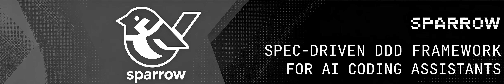

# 🪶 Sparrow



> Spec-driven DDD framework for AI coding assistants.
>
> The npm package is published as **`sparrow-ddd`**.

Sparrow transforms raw business requirements into production-ready code through a structured 6-step Domain-Driven Design (DDD) pipeline. It generates **skills and commands** for AI coding assistants (Claude Code, OpenCode, Cursor), letting each host's native AI capabilities guide you from business analysis to code generation — no multi-agent framework required.

## Why Sparrow?

- **No lock-in**: Works with Claude Code, OpenCode, and Cursor out of the box. Uses each tool's native AI — no CrewAI, LangChain, or other agent frameworks.
- **Spec-driven**: Every step produces concrete, version-controlled Markdown artifacts. You always know what was decided and why.
- **DDD-native**: Follows Domain-Driven Design principles end-to-end: business services → subdomains → bounded contexts → domain models → code.
- **Multi-language**: Supports Java, Python, Node.js/TypeScript, Go, and Rust. Each bounded context can use a different tech stack.
- **Incremental & conversational**: Pause at any step, refine artifacts through dialog, then continue. Each skill reads the latest output from the previous step.

## Installation

### From npm (recommended)

```bash
# Global install
npm install -g sparrow-ddd

# Or use without installing
npx sparrow-ddd init
```

### From local directory (development / offline)

If you have cloned the Sparrow repository locally, you can install directly from the local directory:

```bash
# Option 1: Use npm link (recommended for development)
cd /path/to/sparrow        # Navigate to the Sparrow project root
npm install                # Install dependencies
npm run build              # Build the project
npm link                   # Link sparrow globally

# Then use it from any directory
cd /path/to/your-project
sparrow init --tools claude

# To unlink
npm unlink -g sparrow-ddd
```

```bash
# Option 2: Install globally from local path
npm install -g /path/to/sparrow

# Option 3: Run the local build artifact directly with npx
node /path/to/sparrow/bin/sparrow.js init --tools claude
```

> **Note**: Local installation is primarily intended for developing and debugging the Sparrow framework itself. For everyday use, install the published version via npm.

**Requirements**: Node.js >= 18

## Quick Start

### 1. Initialize Sparrow in your project

```bash
cd your-project
sparrow init
```

Sparrow detects which AI tools you have installed and asks which to configure. You can also specify explicitly:

```bash
# Set up for Claude Code only
sparrow init --tools claude

# Set up for multiple tools
sparrow init --tools claude,opencode,cursor

# Set up for all supported tools, no prompts
sparrow init --tools all --force
```

This creates skill and command files for each selected tool:

```
your-project/
├── .claude/
│   ├── skills/
│   │   ├── sparrow-harness/SKILL.md
│   │   ├── sparrow-explore/SKILL.md
│   │   ├── sparrow-arch/SKILL.md
│   │   ├── sparrow-design/SKILL.md
│   │   ├── sparrow-model/SKILL.md
│   │   ├── sparrow-plan/SKILL.md
│   │   └── sparrow-apply/SKILL.md
│   └── commands/sparrow/
│       ├── sparrow-harness.md
│       ├── sparrow-explore.md
│       ├── sparrow-arch.md
│       └── ...
├── .opencode/          # (if OpenCode selected)
│   └── ...
├── .cursor/            # (if Cursor selected)
│   └── ...
├── docs/sparrow/harness/  # Project-level constraint assets (placeholders)
└── sparrow.json        # Project config
```

`sparrow init` also writes the **global constraint assets** (DDD-universal discipline) to the global config directory (`~/.config/sparrow/harness` on macOS/Linux, `%APPDATA%\sparrow\harness` on Windows).

After initialization, you can check for updates at any time:

```bash
sparrow update
```

This compares your local version against the npm registry and prompts you to upgrade if a newer version is available. It also syncs global constraint assets (creating or refreshing managed templates) whenever you run it.

### 3. Run the pipeline

Invoke each skill in order as a slash command in your AI tool:

| Step | Command | Level | What it does |
|------|---------|-------|--------------|
| 0 | `/sparrow-harness` | Helper | View, add, and maintain constraint assets (harness) — available at any time |
| 1 | `/sparrow-explore` | Product | Interactive requirement exploration (Grill Me) + generate functional & quality requirement docs |
| 2 | `/sparrow-arch` | Product | Define business architecture (subdomains) + application architecture (bounded contexts) |
| 3 | `/sparrow-design @{slug}` | Team | Define API contracts and select tech stack for a bounded context |
| 4 | `/sparrow-model @{slug}` | Team | Three-stage domain modeling: static (class diagram + OOP principles) + dynamic (sequence diagram) + integration |
| 5 | `/sparrow-plan @{slug}` | Team | Devise implementation plan with task checklist |
| 6 | `/sparrow-apply @{slug}` | Team | Generate DDD-structured code with TDD + OOP encapsulation rules |

> **Important**: Steps must run in order. Each skill checks that prerequisites exist and will tell you which step to run first if the order is wrong.

### 4. Iterate and refine

After any step, you can:
- Review the generated Markdown artifacts
- Discuss changes with the AI ("Update the subdomain classification...")
- Re-run the skill with modifications
- Continue to the next step — it always reads the latest version

## The 6-Step Pipeline

### Step 1: sparrow-explore (Product-level)

**Input**: Raw requirements document or description  
**Output**:
- `docs/sparrow/requirement/prd-business.md` — structured business service definitions
- `docs/sparrow/requirement/prd-quanlity.md` — system quality attributes (performance, security, high availability, etc.)

sparrow-explore now uses a **Grill Me** interactive exploration pattern: the AI asks one question at a time with a recommended answer, and you confirm (yes/no/modify). Questions cover six dimensions: actors, core flows, business rules, boundary conditions, exception scenarios, and quality attributes. After exploration, a quick summary is provided, and two spec documents are generated — functional requirements as business services, and quality attributes covering only the dimensions actually required.

### Step 2: sparrow-arch (Product-level)

**Input**: `requirement/prd-business.md` + `requirement/prd-quanlity.md`  
**Output**:
- `docs/sparrow/architecture/business.md` — subdomains (core/supporting/generic) + Mermaid business architecture diagram
- `docs/sparrow/architecture/application.md` — bounded contexts, context mapping, four-layer application architecture diagram
- `docs/sparrow/design/{slug}/spec.md` — per-context sliced business specs

Classifies subdomains into core (competitive advantage), supporting (business-essential), and generic (buy vs build). Maps them to bounded contexts with relationship patterns (ACL, OHS, Conformist, Customer-Supplier, Shared Kernel, Publisher-Subscriber, Separate Ways). Enforces the autonomy principle (minimally complete, self-fulfilling domain knowledge with logical — not necessarily microservice — isolation) and cross-BC communication discipline (same-process: southbound Client → northbound local service; cross-process: public API / domain events; never direct access to another BC's domain objects).

### Step 3: sparrow-design (Team-level, per bounded context)

**Input**: `architecture/application.md` + `design/{slug}/spec.md`  
**Output**:
- `docs/sparrow/design/{slug}/api.md` — service contracts with Mermaid sequence diagrams and RESTful API definitions
- `docs/sparrow/design/{slug}/tech.md` — technology stack selection (language, framework, database, messaging, testing)

Interactive tech stack selection: choose from Java (Spring Boot), Python (FastAPI), Node.js/TypeScript (Express/NestJS), Go (chi/net/http), or Rust (Axum). Each language gets multiple concrete stack options.

### Step 4: sparrow-model (Team-level)

**Input**: `spec.md` + `api.md` + `tech.md`  
**Output**: `docs/sparrow/design/{slug}/model.md` — complete domain model with three stages

- **Stage 1 — Static Modeling**: Unified language glossary, entity/value object identification, aggregate root operation definitions guided by OOP principles (Information Expert, Law of Demeter, anti-anemic model, encapsulation). PlantUML class diagram with private fields and business-focused operations, no unnecessary getters/setters.
- **Stage 2 — Dynamic Modeling**: API-driven task decomposition trees, role stereotype assignment (Command/Query/AppService/DomainService/Aggregate/Port), PlantUML sequence diagrams with color-coded participants and strict collaboration constraints.
- **Stage 3 — Static-Dynamic Integration**: Cross-verify operations extracted from sequence diagrams against the static model. Sequence diagram operations take precedence — update the class diagram to ensure complete consistency between structure and behavior.

### Step 5: sparrow-plan (Team-level)

**Input**: `spec.md` + `api.md` + `tech.md` + `model.md`  
**Output**: `docs/sparrow/design/{slug}/plan.md` — ordered implementation plan

Creates tasks with `[ ]` checkboxes, sorted by DDD layer dependency (domain → infrastructure → application → api). Each task specifies: executor (`dev` for product code with TDD, `qa` for integration tests), parallelizability, and step-level granularity matching aggregate boundaries.

### Step 6: sparrow-apply (Team-level)

**Input**: `plan.md`  
**Output**:
- `code/{slug}/` — DDD four-layer module (api/application/domain/infrastructure)
- `integration-tests/{slug}/` — isolated integration/API tests
- `docs/sparrow/design/{slug}/code_review.md` — review report

Drives three roles: Development Engineer (DDD code + domain TDD), QA Engineer (integration/API tests), and Code Review. Follows language-specific coding standards, directory layouts, and OOP encapsulation rules (no unnecessary getters/setters, rich domain model, Law of Demeter). Checks off completed steps in `plan.md`.

## Output Structure

After running the full pipeline, your project will have:

```
your-project/
├── docs/sparrow/
│   ├── requirement/
│   │   ├── prd-business.md               # sparrow-explore (functional requirements)
│   │   └── prd-quanlity.md               # sparrow-explore (quality attributes)
│   ├── architecture/
│   │   ├── business.md                   # sparrow-arch (phase 1)
│   │   └── application.md                # sparrow-arch (phase 2)
│   ├── project.md                        # Project catalog index
│   └── design/{english-slug}/
│       ├── spec.md                       # Per-context sliced spec
│       ├── api.md                        # sparrow-design
│       ├── tech.md                       # sparrow-design
│       ├── model.md                      # sparrow-model
│       ├── plan.md                       # sparrow-plan
│       └── code_review.md                # sparrow-apply
├── backend/{slug}/                       # sparrow-apply
│   ├── api/command/, query/, dto/
│   ├── application/
│   ├── domain/aggregate/, entity/, valueobject/, service/
│   └── infrastructure/port/, adapter/
├── integration-tests/{slug}/             # sparrow-apply (qa tasks)
└── sparrow.json                          # Project config
```

All bounded contexts share the same project root namespace, but each is an independent module with its own language-specific scaffold and dependency management.

## Constraint Assets (Harness)

Sparrow ships **constraint assets** (harness) — the "must / must not" DDD discipline that each stage enforces. They live in two places:

| Scope | Location | Contents |
|-------|----------|----------|
| **Global** | `~/.config/sparrow/harness/` (macOS/Linux), `%APPDATA%\sparrow\harness` (Windows) | DDD-universal discipline, written by `sparrow init` and synced by `sparrow update` |
| **Project** | `docs/sparrow/harness/` | Project-specific constraints; placeholder files created by `sparrow init`, free to edit |

**Precedence**: project-level constraints > global constraints. On conflict the project level wins; if a project file is empty/missing, the global level is used directly.

The global harness contains one file per stage plus a constitution:

```
harness/
├── constitution.md            # Aggregate index: stage → file → description
├── explore/requirements.md    # Business service identification discipline
├── arch/business.md           # Subdomain classification discipline
├── arch/application.md        # Bounded context, autonomy & communication discipline
├── design/api-design.md       # Service contract & API discipline
├── model/architecture.md      # Four layers, stereotypes, PO & call rules
├── model/domain-modeling.md   # Aggregates & OOP discipline
└── apply/implementation.md    # Code generation & encapsulation discipline
```

How it works:

- Each stage skill references the harness in a `📐 约束资产（Harness）` section telling the AI to load the relevant constraint files **before** executing.
- **`/sparrow-harness`** is an auxiliary command (available anytime, independent of the pipeline) to view the index, and to add/update/delete project-level constraints. New constraints are auto-classified into the right stage file — you don't need to pick a stage.
- Managed global templates are refreshed on version upgrade, but **user-edited files are never overwritten** (project files are always yours).

## Supported AI Tools

| Tool | Skills Directory | Commands Directory | Detection |
|------|-----------------|-------------------|-----------|
| **Claude Code** | `.claude/skills/` | `.claude/commands/sparrow/` | `.claude/` directory |
| **OpenCode** | `.opencode/skills/` | `.opencode/commands/` | `.opencode/` directory |
| **Cursor** | `.cursor/skills/` | `.cursor/commands/` | `.cursor/` directory |
| **Codex (OpenAI)** | `.codex/skills/` | `.codex/commands/` | `.codex/` directory |
| **Kiro** | `.kiro/skills/` | *from skills* | `.kiro/` directory |
| **Qoder** | `.qoder/skills/` | `.qoder/commands/` | `.qoder/` directory |
| **Trae** | `.trae/skills/` | `.trae/commands/` | `.trae/` directory |

## Configuration

### sparrow.json

Generated by `sparrow init` in your project root:

```json
{
  "version": "0.2.1",
  "tools": ["claude", "opencode"],
  "createdAt": "2026-06-29T04:05:45.650Z",
  "outputBase": "docs/sparrow",
  "codeBase": "code"
}
```

### Overriding output paths

Future versions will support a `sparrow.yaml` file for customizing output paths:

```yaml
sparrow_docs_root: docs/my-company
paths:
  requirement_spec: specs/requirements.md
  architecture_business: specs/architecture/biz.md
  architecture_application: specs/architecture/app.md
```

## Supported Languages & Tech Stacks

| Language | Default Framework | Build Tool | Status |
|----------|------------------|------------|--------|
| Java 17+ | Spring Boot 3.x | Maven | ✅ |
| Python 3.12+ | FastAPI | uv | ✅ |
| Node.js | Express / NestJS | npm | ✅ |
| Go 1.22+ | chi / net/http | Go modules | ✅ |
| Rust (stable) | Axum | Cargo | ✅ |

Each language has its own DDD directory layout, coding standards, and anti-pattern rules embedded in the skill prompts.

## How It Works

1. **`sparrow init`** generates skill/command files into each AI tool's directory, plus global and project-level constraint assets (harness)
2. Each **skill** is a Markdown file with YAML frontmatter containing:
   - Role definition (business architect, application architect, DDD expert, etc.)
   - First principles and design rules
   - Step-by-step instructions
   - Output templates with Mermaid/PlantUML examples
   - Quality checklists
3. Each stage skill **loads its constraint assets** (`📐 约束资产（Harness）`) — project-level and global rules — before executing
4. The **AI assistant** reads the skill and executes it, reading input files and writing output files
5. Each skill **checks prerequisites** — if something is missing, it tells you which skill to run first
6. After completing, each skill **hints at the next step**

**No multi-agent framework needed.** The AI coding assistant itself provides intelligence, multi-agent capabilities, and LLM configuration. Sparrow only provides the structured knowledge and process guidance.

## Development

```bash
# Install dependencies
npm install

# Build
npm run build

# Type check
npm run typecheck
# or: npx tsc --noEmit

# Run locally (dev mode)
npm run dev -- init --tools claude --force

# Run compiled binary
node bin/sparrow.js init --tools claude

# Clean build artifacts
npm run clean
```

## License

MIT

---

🪶 *From business requirements to production code, one spec at a time.*
