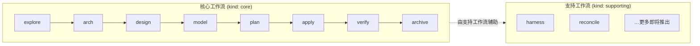

# 🪶 Sparrow

[English](./README.md) | 简体中文


> 面向 AI 编程助手的规格驱动 DDD 框架。
>
> npm 包发布名为 **`sparrow-ddd`**。

Sparrow 通过结构化的 DDD 流程，将原始业务需求转化为可投入生产的代码。流程分为 **核心工作流**（顺序执行的八步流水线）与 **支持工作流**（如 harness、reconcile 等随时可用的辅助命令）。它引入了 **交互上下文（Interaction Context）** 这一与限界上下文（Bounded Context）并列的一等架构概念，负责所有前端 UI 与 BFF 聚合。后端限界上下文与交互上下文共享同一套标准化的 `design → model → plan → apply` 工作流，且彼此完全正交——无相互依赖，可并行执行。

> 📜 版本历史与亮点：参见 [CHANGELOG](./CHANGELOG.md) 与 [GitHub Releases](https://github.com/agiledon/sparrow/releases)。

## 为什么选择 Sparrow？

- **无厂商锁定**：开箱即用支持 Claude Code、OpenCode、Cursor 和 Pi。使用各工具原生 AI——无需 CrewAI、LangChain 或其他 Agent 框架。
- **规格驱动**：每一步都产出具体、可版本控制的 Markdown 制品。你始终清楚做了什么决策以及原因。
- **原生 DDD**：端到端遵循领域驱动设计：业务服务 → 子域 → 限界上下文 → 领域模型 → 代码。
- **多语言支持**：支持 Java、Python、Node.js/TypeScript、Go、Rust 和 C++。每个限界上下文可使用不同技术栈。
- **增量与对话式**：可在任意步骤暂停，通过对话 refine 制品，然后继续。每个 skill 都会读取上一步的最新输出。

## 开发工作流

Sparrow 将所有 AI 辅助开发组织为两类工作流。每个 skill 都带有 `kind` 字段——`core` 或 `supporting`——表明它在整体 DDD 流程中的角色：

| 类别 | `kind` | 角色 | 运行时机 |
|------|--------|------|----------|
| **核心工作流** | `core` | 顺序执行的 DDD 流水线——从需求到可验证、可归档的代码 | 按序运行；产品级步骤一次，团队级步骤按上下文 |
| **支持工作流** | `supporting` | 辅助 DDD 流程的附加能力，不替代流水线本身 | 随时调用，与流水线位置无关 |



### 核心工作流

**核心工作流**是 Sparrow 的主规格驱动 DDD 流水线——八个有序步骤，将原始需求转化为可投入生产的代码。每个核心 skill 读取上一步的制品，输出可版本控制的 Markdown 或代码。

| 步骤 | 命令 | 层级 | 作用 |
|------|------|------|------|
| 1 | `/sparrow-explore` | 产品级 | 交互式需求探索（Grill Me）+ 生成功能与质量需求文档 + [可选] UI 设计探索 |
| 2 | `/sparrow-arch` | 产品级 | 定义业务架构（子域）+ 应用架构（限界上下文）+ [若有 UI] 含交互上下文的前端架构 |
| 3 | `/sparrow-design @{slug}` | 团队级 | 为限界上下文或交互上下文定义 API 契约与技术栈 |
| 4 | `/sparrow-model @{slug}` | 团队级 | 领域建模（后端 BC）或 ViewModel + 组件建模（交互上下文） |
| 5 | `/sparrow-plan @{slug}` | 团队级 | 制定含任务清单的实施计划 |
| 6 | `/sparrow-apply @{slug}` | 团队级 | 生成 DDD 结构化代码（后端）或前端 + BFF 代码（交互上下文） |
| 7 | `/sparrow-verify @{slug}` | 团队级 | 对照 spec.md、api.md、tech.md、model.md 验证代码实现 |
| 8 | `/sparrow-archive` | 团队级 | 归档已完成的 revise 模式变更（verify 通过后） |

**核心工作流运行规则：**

- **产品级**步骤（1–2）每个项目或重大 initiative **运行一次**——建立共享的需求与架构基线。
- **团队级**步骤（3–8）**按 slug 运行**——每个限界上下文与交互上下文各跑一遍。所有上下文共用同一套命令且完全正交：无相互依赖，可按任意顺序或并行执行。
- 任一步骤完成后可暂停审阅、对话 refine 并重新运行——下一步始终读取最新版本。

各步骤的输入、输出与细节见下文 [核心工作流参考](#核心工作流参考)。

### 支持工作流

**支持工作流**是在项目全生命周期中帮助你保持 DDD 纪律的辅助命令。它们**不替代**核心流水线步骤，也**无顺序要求**——在需要时随时调用即可。

所有支持命令使用 `sparrow-supporting-` 前缀，并标记为 `kind: supporting`。未来将陆续增加更多支持工作流，覆盖 DDD 开发流程中的更多场景（如漂移检测、迁移辅助、跨上下文一致性检查等）。

| 工作流 | 命令 | 作用 |
|--------|------|------|
| **Harness** | `/sparrow-supporting-harness` | 查看、添加与维护约束资产——项目级「必须 / 禁止」DDD 规则，核心 skill 执行前会加载 |
| **Reconcile** | `/sparrow-supporting-reconcile` | vibe coding 或 bugfix 后，将**现有**规格文档与 harness 约束与当前代码对齐——不改变架构、不新建规格文件 |

**支持工作流典型用法：**

- **核心步骤之前或期间** — 用 **harness** 添加项目专属约束（编码规范、命名规则、集成策略等），后续每个核心 skill 都会强制执行。
- **临时改动之后** — 当代码与规格出现漂移（手工修改、快速修复、探索性编码）时，用 **reconcile** 将文档与约束拉回与实现一致。
- **verify 失败之后** — 若 P0/P1 问题源于规格漂移而非代码缺陷，先 reconcile，再重新运行 verify。

## 安装

### 从 npm 安装（推荐）

```bash
# 全局安装
npm install -g sparrow-ddd

# 或不安装直接运行
npx sparrow-ddd init
```

### 从本地目录安装（开发 / 离线）

若已在本地克隆 Sparrow 仓库，可直接从本地目录安装：

```bash
# 方式 1：使用 npm link（开发推荐）
cd /path/to/sparrow        # 进入 Sparrow 项目根目录
npm install                # 安装依赖
npm run build              # 构建项目
npm link                   # 全局链接 sparrow

# 然后在任意目录使用
cd /path/to/your-project
sparrow init --tools claude

# 取消链接
npm unlink -g sparrow-ddd
```

```bash
# 方式 2：从本地路径全局安装
npm install -g /path/to/sparrow

# 方式 3：用 npx 直接运行本地构建产物
node /path/to/sparrow/bin/sparrow.js init --tools claude
```

> **说明**：本地安装主要用于开发与调试 Sparrow 框架本身。日常使用请通过 npm 安装已发布版本。

**环境要求**：Node.js >= 18

## 快速开始

### 1. 在项目中初始化 Sparrow

```bash
cd your-project
sparrow init
```

Sparrow 会检测已安装的 AI 工具并询问要配置哪些。也可显式指定：

```bash
# 仅配置 Claude Code
sparrow init --tools claude

# 配置多个工具
sparrow init --tools claude,opencode,cursor,pi

# 配置所有支持的工具，无需交互
sparrow init --tools all --force
```

这将为每个所选工具创建 skill 与 command 文件：

```
your-project/
├── .claude/
│   ├── skills/
│   │   ├── sparrow-explore/SKILL.md
│   │   ├── sparrow-arch/SKILL.md
│   │   ├── sparrow-design/SKILL.md
│   │   ├── sparrow-model/SKILL.md
│   │   ├── sparrow-plan/SKILL.md
│   │   ├── sparrow-apply/SKILL.md
│   │   ├── sparrow-verify/SKILL.md
│   │   ├── sparrow-archive/SKILL.md
│   │   ├── sparrow-supporting-harness/SKILL.md
│   │   └── sparrow-supporting-reconcile/SKILL.md
│   └── commands/sparrow/
│       ├── sparrow-explore.md
│       ├── sparrow-arch.md
│       └── ...
├── .opencode/          #（若选择了 OpenCode）
│   └── ...
├── .cursor/            #（若选择了 Cursor）
│   └── ...
├── .pi/                #（若选择了 Pi）
│   └── ...
├── docs/sparrow/harness/  # 项目级约束资产（占位文件）
└── sparrow.json        # 项目配置
```

`sparrow init` 还会将**全局约束资产**（DDD 通用纪律）写入全局配置目录（macOS/Linux 为 `~/.config/sparrow/harness`，Windows 为 `%APPDATA%\sparrow\harness`）。

初始化后，可随时检查更新：

```bash
sparrow update
```

该命令会将本地版本与 npm registry 对比，若有新版本则提示升级。每次运行也会同步全局约束资产（创建或刷新受管模板）。

### 3. 运行工作流

在 AI 工具中以斜杠命令调用 skill。Sparrow 提供两类工作流——完整说明见 [开发工作流](#开发工作流)：

- **核心工作流** — 按序运行八步流水线：`/sparrow-explore` → `/sparrow-arch` → `/sparrow-design @{slug}` → … → `/sparrow-verify @{slug}` → `/sparrow-archive`
- **支持工作流** — 按需随时调用：`/sparrow-supporting-harness`、`/sparrow-supporting-reconcile`

> **重要**：产品级核心步骤（1–2）运行一次。团队级核心步骤（3–8）按 slug 运行——所有上下文（后端 BC + 交互上下文）共用同一套命令且完全正交。

### 4. 迭代与 refine

任一步骤完成后，你可以：
- 审阅生成的 Markdown 制品
- 与 AI 讨论修改（「更新子域分类……」）
- 带修改重新运行 skill
- 继续下一步——下一步始终读取最新版本

## 核心工作流参考

[核心工作流](#核心工作流) 各步骤的输入、输出与行为细节。

### 步骤 1：sparrow-explore（产品级）

**输入**：原始需求文档或描述  
**输出**：
- `docs/sparrow/requirement/prd-business.md` — 结构化业务服务定义
- `docs/sparrow/requirement/prd-quanlity.md` — 系统质量属性（性能、安全、高可用等）
- `docs/sparrow/requirement/ui/` — \[可选\] UI 设计规格、设计令牌、组件库与交互式 HTML 原型

sparrow-explore 采用 **Grill Me** 交互探索模式，分两阶段。**阶段 1**：业务需求——覆盖参与者、核心流程、业务规则、边界条件、异常场景与质量属性。**阶段 2**：生成需求文档后，可选进入 **UI 设计探索**（同样为 Grill Me），产出用户画像、旅程、页面概念与视觉偏好——纯 UX，不限界上下文关联。

### 步骤 2：sparrow-arch（产品级）

**输入**：`requirement/prd-business.md` + `requirement/prd-quanlity.md` + \[可选\] `requirement/ui/`  
**输出**：
- `docs/sparrow/architecture/business.md` — 子域（核心/支撑/通用）+ Mermaid 业务架构图
- `docs/sparrow/architecture/application.md` — 限界上下文、上下文映射、四层应用架构图
- `docs/sparrow/design/{slug}/spec.md` — 按上下文切片的业务规格
- `docs/sparrow/architecture/frontend.md` — \[若有 UI\] 含交互上下文定义、技术栈选型、BFF 设计与 API 契约绑定表的前端架构

将子域分类为核心、支撑与通用，映射为限界上下文及关系模式。**若存在 UI 需求**，额外生成前端架构，包括：交互式技术栈选型（Web/Mobile/QT/BFF）、**交互上下文**定义（与 BC 同级、涵盖全部 UI + BFF 聚合），以及 **API 契约绑定表**——唯一同步点，保证前后端契约一致，使后续 BC 与交互上下文的 design/model/plan/apply 可独立、无相互依赖地执行。

### 步骤 3：sparrow-design（团队级，按上下文）

**输入**：`design/{slug}/spec.md` + 架构文档  
**输出**：
- `docs/sparrow/design/{slug}/api.md` — 服务契约（后端 BC）或含 ViewModel 接口的 BFF API 规格（交互上下文）
- `docs/sparrow/design/{slug}/tech.md` — 技术栈选型

**后端 BC**：交互式技术栈选型（Java/Python/Node.js/Go/Rust/REST/gRPC）。**交互上下文**：BFF 聚合端点设计、ViewModel 定义及前端 + BFF 技术栈选型。交互上下文 design 不读取任何 BC 的 api.md——契约一致性由 frontend.md 中的绑定表保证。

### 步骤 4：sparrow-model（团队级，按上下文）

**输入**：`spec.md` + `api.md` + `tech.md`  
**输出**：`docs/sparrow/design/{slug}/model.md`

**后端 BC**：三阶段领域建模（静态类图 + 动态时序图 + 集成）。**交互上下文**：ViewModel 静态模型、组件树模型与数据流模型。

### 步骤 5：sparrow-plan（团队级，按上下文）

**输入**：`spec.md` + `api.md` + `tech.md` + `model.md`  
**输出**：`docs/sparrow/design/{slug}/plan.md` — 有序实施计划

**后端 BC**：按 DDD 层依赖组织任务。**交互上下文**：按页面/功能组织任务并标注可并行项，覆盖前端组件开发、BFF 聚合实现与集成测试。

### 步骤 6：sparrow-apply（团队级，按上下文）

**输入**：`plan.md`  
**输出**：
- `backend/{slug}/` — 后端 BC 的 DDD 四层模块（api/application/domain/infrastructure）
- `integration-tests/{slug}/` — 独立集成/API 测试
- `docs/sparrow/design/{slug}/code_review.md` — 审查报告

**交互上下文** 将前端代码生成至 `frontend/features/`，BFF 聚合代码生成至 `edge/bff/`。

### 步骤 7：sparrow-verify（团队级，按上下文）

**输入**：已 apply 的代码 + `spec.md` + `api.md` + `tech.md` + `model.md`  
**输出**：`docs/sparrow/design/{slug}/verify_report.md` — 完整性、正确性与一致性报告，含按严重程度分类的发现项

仅在所选 slug 完成 apply 后运行。尚未 apply 的 slug 会跳过。

### 步骤 8：sparrow-archive（团队级，revise 工作流）

**输入**：`docs/sparrow/changes/{change-id}/` 下已完成的变更  
**输出**：归档至 `docs/sparrow/changes/archive/`

在 verify 通过（无 P0/P1 阻塞项）且存在活跃 revise 模式变更时运行。无活跃变更的基线项目不需要此步骤。

## 输出结构

运行完整流水线后，项目将包含：

```
your-project/
├── docs/sparrow/
│   ├── requirement/
│   │   ├── prd-business.md               # sparrow-explore（功能需求）
│   │   ├── prd-quanlity.md               # sparrow-explore（质量属性）
│   │   └── ui/                            # [可选] sparrow-explore（UI 设计探索）
│   │       ├── ui-spec.md
│   │       ├── design-tokens.md
│   │       ├── components/
│   │       └── prototypes/
│   ├── architecture/
│   │   ├── business.md                   # sparrow-arch（子域）
│   │   ├── application.md                # sparrow-arch（限界上下文）
│   │   └── frontend.md                   # [可选] sparrow-arch（前端 + 交互上下文）
│   ├── project.md                        # 项目目录索引
│   └── design/{english-slug}/
│       ├── spec.md                       # 按上下文切片的规格
│       ├── api.md                        # sparrow-design
│       ├── tech.md                       # sparrow-design
│       ├── model.md                      # sparrow-model
│       ├── plan.md                       # sparrow-plan
│       ├── code_review.md                # sparrow-apply
│       └── verify_report.md              # sparrow-verify
├── backend/{slug}/                       # sparrow-apply（后端 BC）
│   ├── api/command/, query/, dto/
│   ├── application/
│   ├── domain/aggregate/, entity/, valueobject/, service/
│   └── infrastructure/port/, adapter/
├── frontend/                             # sparrow-apply（交互上下文）
│   ├── features/{name}/
│   └── shared/
├── edge/bff/                             # sparrow-apply（BFF 聚合）
├── integration-tests/{slug}/             # sparrow-apply（QA 任务）
└── sparrow.json                          # 项目配置
```

所有限界上下文共享同一项目根命名空间，但各自为独立模块，拥有专属语言脚手架与依赖管理。

## 约束资产（Harness）

Sparrow 内置 **约束资产**（harness）——各阶段强制执行的「必须 / 禁止」DDD 纪律。存放于两处：

| 范围 | 位置 | 内容 |
|------|------|------|
| **全局** | `~/.config/sparrow/harness/`（macOS/Linux），`%APPDATA%\sparrow\harness`（Windows） | DDD 通用纪律，由 `sparrow init` 写入、`sparrow update` 同步 |
| **项目** | `docs/sparrow/harness/` | 项目专属约束；`sparrow init` 创建占位文件，可自由编辑 |

**优先级**：项目级 > 全局级。冲突时项目级优先；若项目文件为空或缺失，则直接使用全局级。

全局 harness 含各阶段文件及一份 constitution：

```
harness/
├── constitution.md            # 聚合索引：阶段 → 文件 → 描述
├── explore/requirements.md    # 业务服务识别 + UI 设计探索纪律
├── arch/business.md           # 子域分类纪律
├── arch/application.md        # 限界上下文、自治与通信纪律
├── arch/frontend.md           # 前端架构与交互上下文纪律
├── design/api-design.md       # 服务契约与 API 纪律
├── model/architecture.md      # 四层、构造型、PO 与调用规则
├── model/domain-modeling.md   # 聚合与 OOP 纪律
├── model/view-modeling.md     # View Model 建模纪律（交互上下文）
└── apply/implementation.md    # 代码生成与封装纪律
```

工作机制：

- 各核心工作流 skill 在 `📐 约束资产（Harness）` 章节引用 harness，要求 AI **在执行前**加载相关约束文件。
- 通过 [**harness 支持工作流**](#支持工作流)（`/sparrow-supporting-harness`）查看索引，增删改项目级约束；新约束会自动归类到对应阶段文件。
- 受管全局模板在版本升级时会刷新，但**用户编辑过的文件不会被覆盖**（项目文件始终归你所有）。

## 支持的 AI 工具

| 工具 | Skills 目录 | Commands 目录 | 检测方式 |
|------|-------------|---------------|----------|
| **Claude Code** | `.claude/skills/` | `.claude/commands/sparrow/` | `.claude/` 目录 |
| **OpenCode** | `.opencode/skills/` | `.opencode/commands/` | `.opencode/` 目录 |
| **Cursor** | `.cursor/skills/` | `.cursor/commands/` | `.cursor/` 目录 |
| **Codex (OpenAI)** | `.codex/skills/` | `.codex/commands/` | `.codex/` 目录 |
| **Kiro** | `.kiro/skills/` | *来自 skills* | `.kiro/` 目录 |
| **Qoder** | `.qoder/skills/` | `.qoder/commands/` | `.qoder/` 目录 |
| **Trae** | `.trae/skills/` | `.trae/commands/` | `.trae/` 目录 |
| **Pi** | `.pi/skills/` | `.pi/prompts/`（提示模板） | `.pi/` 目录 |

## 配置

### sparrow.json

由 `sparrow init` 在项目根目录生成：

```json
{
  "version": "0.3.0",
  "tools": ["claude", "opencode"],
  "createdAt": "2026-06-29T04:05:45.650Z",
  "outputBase": "docs/sparrow",
  "codeBase": "code"
}
```

### 覆盖输出路径

未来版本将支持 `sparrow.yaml` 自定义输出路径：

```yaml
sparrow_docs_root: docs/my-company
paths:
  requirement_spec: specs/requirements.md
  architecture_business: specs/architecture/biz.md
  architecture_application: specs/architecture/app.md
```

## 支持的语言与技术栈

| 语言 | 默认框架 | 构建工具 | 状态 |
|------|----------|----------|------|
| Java 17+ | Spring Boot 3.x | Maven | ✅ |
| Python 3.12+ | FastAPI | uv | ✅ |
| Node.js | Express / NestJS | npm | ✅ |
| Go 1.22+ | chi / net/http | Go modules | ✅ |
| Rust (stable) | Axum | Cargo | ✅ |
| C++ 17+ | Qt 6.x（前端） | CMake | ✅ |

每种语言在 skill 提示词中嵌入各自的 DDD 目录布局、编码规范与反模式规则。

## 工作原理

1. **`sparrow init`** 向各 AI 工具目录生成 skill/command 文件，以及全局与项目级约束资产（harness）。Skill 分为 **core**（流水线步骤）与 **supporting**（辅助工作流）两类。
2. 每个 **skill** 是带 YAML frontmatter 的 Markdown 文件，包含：
   - 角色定义（业务架构师、应用架构师、DDD 专家等）
   - 第一性原理与设计规则
   - 分步说明
   - 含 Mermaid/PlantUML 示例的输出模板
   - 质量检查清单
3. 各阶段 skill **加载约束资产**（`📐 约束资产（Harness）`）——项目级与全局规则——再执行
4. **AI 助手**读取 skill 并执行，读取输入文件、写入输出文件
5. 每个 skill **检查前置条件**——若缺失会提示应先运行哪个 skill
6. 完成后每个 skill **提示下一步**

**无需多 Agent 框架。** AI 编程助手本身提供智能、多 Agent 能力与 LLM 配置。Sparrow 只提供结构化知识与流程引导。

## 开发

```bash
# 安装依赖
npm install

# 构建
npm run build

# 类型检查
npm run typecheck
# 或：npx tsc --noEmit

# 本地运行（开发模式）
npm run dev -- init --tools claude --force

# 运行编译后的二进制
node bin/sparrow.js init --tools claude

# 清理构建产物
npm run clean
```

## 许可证

MIT

---

🪶 *从业务需求到生产代码——后端与前端，统一于一条规格驱动流水线。*
