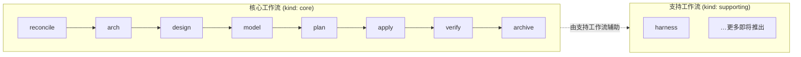

# 🪶 Sparrow

[English](./README.md) | 简体中文


> 面向 AI 编程助手的规格驱动 DDD 框架。
>
> npm 包发布名为 **`sparrow-ddd`**。

Sparrow 通过结构化的 DDD 流程，将原始业务需求转化为可投入生产的代码。流程分为 **核心工作流**（顺序执行的八步流水线）与 **支持工作流**（如 harness、reconcile 等随时可用的辅助命令）。它引入了 **交互上下文（Interaction Context）** 这一与限界上下文（Bounded Context）并列的一等架构概念，负责所有前端 UI 与 BFF 聚合。后端限界上下文与交互上下文共享同一套标准化的 `design → model → plan → apply` 工作流，且彼此完全正交——无相互依赖，可并行执行。

> 📜 版本历史与亮点：参见 [CHANGELOG](./CHANGELOG.md) 与 [GitHub Releases](https://github.com/agiledon/sparrow/releases)。

## 为什么选择 Sparrow？

- **无厂商锁定**：开箱即用支持 Claude Code、OpenCode、Cursor 和 Pi。使用各工具原生 AI——无需 CrewAI、LangChain 或其他 Agent 框架。
- **规格驱动**：每一步都产出具体、可版本控制的 Markdown 制品。你始终清楚做了什么决策以及原因。
- **原生 DDD**：端到端遵循领域驱动设计：业务服务 → 子域 → 限界上下文 → 领域模型 → 代码。
- **多语言支持**：支持 Java、Python、Node.js/TypeScript、Go、Rust 和 C++。每个限界上下文可使用不同技术栈。
- **增量与对话式**：可在任意步骤暂停，通过对话 refine 制品，然后继续。每个 skill 都会读取上一步的最新输出。

## 开发工作流

Sparrow 将所有 AI 辅助开发组织为两类工作流。每个 skill 都带有 `kind` 字段——`core` 或 `supporting`——表明它在整体 DDD 流程中的角色：

| 类别 | `kind` | 角色 | 运行时机 |
|------|--------|------|----------|
| **核心工作流** | `core` | 顺序执行的 DDD 流水线——从需求到可验证、可归档的代码 | 按序运行；产品级步骤一次，团队级步骤按上下文 |
| **支持工作流** | `supporting` | 辅助 DDD 流程的附加能力，不替代流水线本身 | 随时调用，与流水线位置无关 |



### 核心工作流

**核心工作流**是 Sparrow 的主规格驱动 DDD 流水线——八个有序步骤，将原始需求转化为可投入生产的代码。每个核心 skill 读取上一步的制品，输出可版本控制的 Markdown 或代码。

| 步骤 | 命令 | 层级 | 作用 |
|------|------|------|------|
| 1 | `/sparrow-requirement` | 产品级 | 交互式需求探索（Grill Me）+ 生成功能与质量需求文档 + [可选] UI 设计探索 |
| 2 | `/sparrow-arch` | 产品级 | 定义业务架构（子域）+ 应用架构（限界上下文）+ [若有 UI] 含交互上下文的前端架构 |
| 3 | `/sparrow-design @{slug}` | 团队级 | 为限界上下文或交互上下文定义 API 契约与技术栈 |
| 4 | `/sparrow-model @{slug}` | 团队级 | 领域建模（后端 BC）或 ViewModel + 组件建模（交互上下文） |
| 5 | `/sparrow-plan @{slug}` | 团队级 | 制定含任务清单的实施计划 |
| 6 | `/sparrow-apply @{slug}` | 团队级 | 生成 DDD 结构化代码（后端）或前端 + BFF 代码（交互上下文） |
| 7 | `/sparrow-verify @{slug}` | 团队级 | 对照 spec.md、api.md、tech.md、model.md 验证代码实现 |
| 8 | `/sparrow-archive` | 团队级 | 归档已完成的 revise 模式变更（verify 通过后） |

**核心工作流运行规则：**

- **产品级**步骤（1–2）每个项目或重大 initiative **运行一次**——建立共享的需求与架构基线。
- **团队级**步骤（3–8）**按 slug 运行**——每个限界上下文与交互上下文各跑一遍。所有上下文共用同一套命令且完全正交：无相互依赖，可按任意顺序或并行执行。
- 任一步骤完成后可暂停审阅、对话 refine 并重新运行——下一步始终读取最新版本。

**规格布局**：活动变更在 `docs/sparrow/change/current/{change-id}/` 读写；已发布基线在 `docs/sparrow/master/`（首次 **archive promote** 后才有内容）。项目类型写在 `proposal.md` 的 `development-mode`：**绿地**（`greenfield`）、**版本迭代**（`iteration`）、**棕地**（`brownfield`）。详见 [输出结构](#输出结构) 与 `docs/prd/sparrow-development-modes.md`。

各步骤的输入、输出与细节见下文 [核心工作流参考](#核心工作流参考)。

### 支持工作流

**支持工作流**是在项目全生命周期中帮助你保持 DDD 纪律的辅助命令。它们**不替代**核心流水线步骤，也**无顺序要求**——在需要时随时调用即可。

所有支持命令使用 `sparrow-supporting-` 前缀，并标记为 `kind: supporting`。未来将陆续增加更多支持工作流，覆盖 DDD 开发流程中的更多场景（如漂移检测、迁移辅助、跨上下文一致性检查等）。

| 工作流 | 命令 | 作用 |
|--------|------|------|
| **Harness** | `/sparrow-supporting-harness` | 查看、添加与维护约束资产——项目级「必须 / 禁止」DDD 规则，核心 skill 执行前会加载 |
| **Reconcile** | `/sparrow-supporting-reconcile` | vibe coding 或 bugfix 后，将**现有**规格文档与 harness 约束与当前代码对齐——不改变架构、不新建规格文件 |

**支持工作流典型用法：**

- **核心步骤之前或期间** — 用 **harness** 添加项目专属约束（编码规范、命名规则、集成策略等），后续每个核心 skill 都会强制执行。
- **临时改动之后** — 当代码与规格出现漂移（手工修改、快速修复、探索性编码）时，用 **reconcile** 将文档与约束拉回与实现一致。
- **verify 失败之后** — 若 P0/P1 问题源于规格漂移而非代码缺陷，先 reconcile，再重新运行 verify。

## 安装

### 从 npm 安装（推荐）

```bash
# 全局安装
npm install -g sparrow-ddd

# 或不安装直接运行
npx sparrow-ddd init
```

### 从本地目录安装（开发 / 离线）

若已在本地克隆 Sparrow 仓库，可直接从本地目录安装：

```bash
# 方式 1：使用 npm link（开发推荐）
cd /path/to/sparrow        # 进入 Sparrow 项目根目录
npm install                # 安装依赖
npm run build              # 构建项目
npm link                   # 全局链接 sparrow

# 然后在任意目录使用
cd /path/to/your-project
sparrow init --tools claude

# 取消链接
npm unlink -g sparrow-ddd
```

```bash
# 方式 2：从本地路径全局安装
npm install -g /path/to/sparrow

# 方式 3：用 npx 直接运行本地构建产物
node /path/to/sparrow/bin/sparrow.js init --tools claude
```

> **说明**：本地安装主要用于开发与调试 Sparrow 框架本身。日常使用请通过 npm 安装已发布版本。

**环境要求**：Node.js >= 18

## 快速开始

### 1. 在项目中初始化 Sparrow

```bash
cd your-project
sparrow init
```

Sparrow 会检测已安装的 AI 工具并询问要配置哪些。也可显式指定：

```bash
# 仅配置 Claude Code
sparrow init --tools claude

# 配置多个工具
sparrow init --tools claude,opencode,cursor,pi

# 配置所有支持的工具，无需交互
sparrow init --tools all --force
```

这将为每个所选工具创建 skill 与 command 文件：

```
your-project/
├── .claude/
│   ├── skills/
│   │   ├── sparrow-requirement/SKILL.md
│   │   ├── sparrow-arch/SKILL.md
│   │   ├── sparrow-design/SKILL.md
│   │   ├── sparrow-model/SKILL.md
│   │   ├── sparrow-plan/SKILL.md
│   │   ├── sparrow-apply/SKILL.md
│   │   ├── sparrow-verify/SKILL.md
│   │   ├── sparrow-archive/SKILL.md
│   │   ├── sparrow-supporting-harness/SKILL.md
│   │   └── sparrow-supporting-reconcile/SKILL.md
│   └── commands/sparrow/
│       ├── sparrow-requirement.md
│       ├── sparrow-arch.md
│       └── ...
├── .opencode/          #（若选择了 OpenCode）
│   └── ...
├── .cursor/            #（若选择了 Cursor）
│   └── ...
├── .pi/                #（若选择了 Pi）
│   └── ...
├── docs/sparrow/
│   ├── master/              # 基线规格（archive promote 后填充）
│   ├── change/current|archive/
│   ├── harness/             # 项目级约束占位
│   └── README.md
└── .sparrow/
    ├── sparrow.json         # 项目配置
    └── active-change.json   # 当前 change-id
```

`sparrow init` 还会将**全局约束资产**（含 `brownfield.md`）写入全局配置目录（macOS/Linux 为 `~/.config/sparrow/harness`，Windows 为 `%APPDATA%\sparrow\harness`）。

初始化后，可随时检查更新：

```bash
sparrow update
```

该命令会将本地版本与 npm registry 对比，若有新版本则提示升级。每次运行也会同步全局约束资产（创建或刷新受管模板）。

### 3. 运行工作流

在 AI 工具中以斜杠命令调用 skill。Sparrow 提供两类工作流——完整说明见 [开发工作流](#开发工作流)：

- **核心工作流** — 按序运行八步流水线：`/sparrow-requirement` → `/sparrow-arch` → `/sparrow-design @{slug}` → … → `/sparrow-verify @{slug}` → `/sparrow-archive`
- **支持工作流** — 按需随时调用：`/sparrow-supporting-harness`、`/sparrow-supporting-reconcile`

> **重要**：产品级核心步骤（1–2）运行一次。团队级核心步骤（3–8）按 slug 运行——所有上下文（后端 BC + 交互上下文）共用同一套命令且完全正交。

### 4. 迭代与 refine

任一步骤完成后，你可以：
- 审阅生成的 Markdown 制品
- 与 AI 讨论修改（「更新子域分类……」）
- 带修改重新运行 skill
- 继续下一步——下一步始终读取最新版本

## 核心工作流参考

[核心工作流](#核心工作流) 各步骤的输入、输出与行为细节。

### 步骤 1：sparrow-requirement（产品级）

**工作区**：`docs/sparrow/change/current/{change-id}/`（无 current 时由本步创建 change-id 与 `proposal.md`）

**输入**：原始需求；**棕地**项目另需结合现有代码与运行行为  
**输出**（均在变更工作区内）：
- `requirement/business/prd-business.md` — 结构化业务服务定义
- `requirement/quality/prd-quality.md` — 系统质量属性（性能、安全、高可用等）
- `requirement/ui/` — \[可选\] UI 设计规格、设计令牌、组件库与 HTML 原型

**Grill Me** 分两阶段：业务需求探索 → 可选 UI 设计探索（纯 UX，不限界上下文）。**版本迭代**时对照 `master/requirement/` 做增量；change 内规格**不写** `<!-- version -->` 元数据块。

### 步骤 2：sparrow-arch（产品级）

**输入**：change 内 `requirement/` + \[可选\] `requirement/ui/`；只读参考 `master/`  
**输出**（change 工作区）：
- `architecture/business.md` — 子域 + Mermaid 业务架构图
- `architecture/application.md` — 限界上下文与上下文映射
- `design/{slug}/spec.md` — 该 BC 的**业务需求规格**切片（非 API 设计文档）
- `architecture/frontend.md` — \[若有 UI\] 交互上下文、BFF、API 契约绑定表

**若存在 UI 需求**，生成前端架构与绑定表，使 BC 与交互上下文后续 design/model/plan/apply 可并行、无互读依赖。BC 拓扑变更须在 **archive** 前经用户确认（见步骤 8）。

### 步骤 3：sparrow-design（团队级，按上下文）

**输入**：`design/{slug}/spec.md` + 架构文档  
**输出**：`design/{slug}/api.md`、`design/{slug}/tech.md`

**后端 BC**：技术栈与 REST/gRPC 等选型。**交互上下文**：BFF 与 ViewModel 接口；不读取 BC 的 api.md，契约由 `frontend.md` 绑定表保证。

### 步骤 4：sparrow-model（团队级，按上下文）

**输入**：`spec.md` + `api.md` + `tech.md`  
**输出**：`design/{slug}/model.md`

**后端 BC**：静态类图 + 动态时序 + 集成。**交互上下文**：ViewModel 与组件树/数据流模型。

### 步骤 5：sparrow-plan（团队级，按上下文）

**输入**：`spec.md` + `api.md` + `tech.md` + `model.md`  
**输出**：`design/{slug}/plan.md`（**仅存在于 change 工作区**，不 promote 到 master）

**后端 BC**：按 DDD 层组织任务。**棕地**（`development-mode=brownfield`）：用户选择 **solidify**（仅测试计划）或 **refactor**（测试 + 重构计划）。

### 步骤 6：sparrow-apply（团队级，按上下文）

**输入**：`plan.md`  
**输出**：
- `backend/{slug}/` — 后端 BC 四层模块
- `integration-tests/{slug}/`
- `change/.../design/{slug}/code_review.md`

**交互上下文**：`frontend/features/`、`edge/bff/`。

### 步骤 7：sparrow-verify（团队级，按上下文）

**输入**：已 apply 的代码 + change 内 `spec.md` / `api.md` / `tech.md` / `model.md`  
**输出**：`design/{slug}/verify_report.md`

仅在所选 slug 完成 apply 后运行。

### 步骤 8：sparrow-archive（团队级，revise 工作流）

**输入**：`docs/sparrow/change/current/{change-id}/` 下已完成的变更  
**输出**：移至 `docs/sparrow/change/archive/YYYY-MM-DD-{change-id}/`，并 **promote** 合并至 `docs/sparrow/master/`（含 requirement/design 两份 revision-history）

在 verify 通过（无 P0/P1 阻塞项）后运行。绿地首次交付完成后亦通过 archive 填充 master。

## 输出结构

规格采用 **master（基线）** 与 **change（变更）** 分离布局，类似「主分支 + 变更分支」。`sparrow init` 会创建目录骨架；活动变更 ID 记录在 `.sparrow/active-change.json`。

| 区域 | 路径 | 说明 |
|------|------|------|
| 基线 | `docs/sparrow/master/` | archive **promote** 后的有效规格正文；含 `project.md` 向导 |
| 活动变更 | `docs/sparrow/change/current/{change-id}/` | 8 步流水线**读写**工作区，目录与 master 同构 |
| 归档 | `docs/sparrow/change/archive/YYYY-MM-DD-{change-id}/` | 某次变更的完整快照 |

**master 与 change 同构内容**（路径均相对于各自根）：

```
project.md
requirement/business/prd-business.md
requirement/quality/prd-quality.md
requirement/ui/                    # 可选
architecture/business.md
architecture/application.md
architecture/frontend.md           # 可选
architecture/api.md                # 项目级 API 总目录（sparrow-design 维护）
design/{slug}/spec.md              # BC 业务需求规格
design/{slug}/api.md | tech.md | model.md
```

**仅 change 工作区额外包含**：`design/{slug}/plan.md`、`code_review.md`、`verify_report.md`、`proposal.md`。

**master 修订历史**（正文合并进各规格文件，历史单独存放）：

- `master/requirement/revision-history.md` — 需求域 promote 摘要（每条含 **synced-at**）
- `master/design/revision-history.md` — 架构 + design 域 promote 摘要
- `master/architecture/bc-revision-history.md` — 限界上下文拓扑变更（须用户确认）

**完整项目树示例**（一次活动变更 + 已 promote 的 master）：

```
your-project/
├── .sparrow/
│   ├── sparrow.json
│   └── active-change.json           # { "changeId": "first-ddd" }
├── docs/sparrow/
│   ├── README.md                    # 布局说明
│   ├── master/
│   │   ├── project.md
│   │   ├── requirement/
│   │   │   ├── business/prd-business.md
│   │   │   ├── quality/prd-quality.md
│   │   │   ├── ui/ …
│   │   │   └── revision-history.md
│   │   ├── architecture/
│   │   │   ├── business.md
│   │   │   ├── application.md
│   │   │   ├── frontend.md          # 可选
│   │   │   ├── api.md               # 项目级 API 总目录
│   │   │   └── bc-revision-history.md
│   │   ├── design/
│   │   │   ├── revision-history.md
│   │   │   └── {slug}/
│   │   │       ├── spec.md
│   │   │       ├── api.md
│   │   │       ├── tech.md
│   │   │       └── model.md         # master 不含 plan.md
│   ├── change/
│   │   ├── current/first-ddd/       # 与 master 同构 + plan 等
│   │   │   ├── proposal.md          # development-mode: greenfield | iteration | brownfield
│   │   │   └── design/{slug}/plan.md
│   │   └── archive/2026-06-06-first-ddd/
│   └── harness/                     # 项目级约束占位
├── backend/{slug}/
├── frontend/
├── edge/bff/
└── integration-tests/{slug}/
```

> **旧布局**：根下直接的 `docs/sparrow/requirement/prd-business.md` 或 `docs/sparrow/changes/` 已废弃，请迁移至 master/change（见 `docs/prd/sparrow-change-management.md`）。

所有限界上下文共享同一项目根命名空间，但各自为独立模块，拥有专属语言脚手架与依赖管理。

## 约束资产（Harness）

Sparrow 内置 **约束资产**（harness）——各阶段强制执行的「必须 / 禁止」纪律。存放于两处：

| 范围 | 位置 | 内容 |
|------|------|------|
| **全局** | `~/.config/sparrow/harness/`（macOS/Linux），`%APPDATA%\sparrow\harness`（Windows） | DDD 通用纪律 + **棕地**约束模板，由 `sparrow init` / `sparrow update` 同步 |
| **项目** | `docs/sparrow/harness/` | 项目专属约束；`sparrow init` 创建占位，可自由编辑 |

**优先级**：项目级 > 全局级。冲突时项目级优先；若项目文件为空或缺失，则直接使用全局级。

全局 harness 含各阶段文件、**棕地项目**约束及 constitution 索引：

```
harness/
├── constitution.md              # 阶段 → 约束文件 → 说明（含棕地行）
├── requirement/requirements.md  # 绿地/迭代：业务服务识别 + UI 探索
├── arch/business.md
├── arch/application.md
├── arch/frontend.md
├── design/api-design.md
├── model/architecture.md
├── model/domain-modeling.md
├── model/view-modeling.md
├── apply/implementation.md
└── brownfield.md                # 棕地：as-is 规格化、plan 的 solidify/refactor 分支
```

**按项目类型加载**：

| development-mode | 除阶段约束外额外加载 |
|------------------|----------------------|
| `greenfield`（绿地） | 各阶段默认 harness |
| `iteration`（版本迭代） | 同绿地；arch 侧重 BC 归属与拓扑确认 |
| `brownfield`（棕地） | **`brownfield.md`** + 各阶段约束；requirement/arch/model 以现有系统取证为主，plan 必须走 solidify 或 refactor |

工作机制：

- 各核心 skill 在 `📐 约束资产（Harness）` 章节引用 harness，要求 AI **执行前**加载对应阶段文件；棕地项目在 `proposal.md` 标明 `brownfield` 时**必须**加载 `brownfield.md`。
- 通过 [**harness 支持工作流**](#支持工作流)（`/sparrow-supporting-harness`）查看索引，增删改项目级约束。
- 受管全局模板在版本升级时会刷新，**用户编辑过的文件不会被覆盖**。

## 支持的 AI 工具

| 工具 | Skills 目录 | Commands 目录 | 检测方式 |
|------|-------------|---------------|----------|
| **Claude Code** | `.claude/skills/` | `.claude/commands/sparrow/` | `.claude/` 目录 |
| **OpenCode** | `.opencode/skills/` | `.opencode/commands/` | `.opencode/` 目录 |
| **Cursor** | `.cursor/skills/` | `.cursor/commands/` | `.cursor/` 目录 |
| **Codex (OpenAI)** | `.codex/skills/` | `.codex/commands/` | `.codex/` 目录 |
| **Kiro** | `.kiro/skills/` | *来自 skills* | `.kiro/` 目录 |
| **Qoder** | `.qoder/skills/` | `.qoder/commands/` | `.qoder/` 目录 |
| **Trae** | `.trae/skills/` | `.trae/commands/` | `.trae/` 目录 |
| **Pi** | `.pi/skills/` | `.pi/prompts/`（提示模板） | `.pi/` 目录 |

## 配置

### sparrow.json

由 `sparrow init` 在 `.sparrow/sparrow.json` 生成：

```json
{
  "version": "0.3.0",
  "tools": ["claude", "opencode"],
  "createdAt": "2026-06-29T04:05:45.650Z",
  "outputBase": "docs/sparrow",
  "codeBase": "code"
}
```

### 覆盖输出路径

未来版本将支持 `sparrow.yaml` 自定义输出路径：

```yaml
sparrow_docs_root: docs/my-company
paths:
  requirement_spec: specs/requirements.md
  architecture_business: specs/architecture/biz.md
  architecture_application: specs/architecture/app.md
```

## 支持的语言与技术栈

| 语言 | 默认框架 | 构建工具 | 状态 |
|------|----------|----------|------|
| Java 17+ | Spring Boot 3.x | Maven | ✅ |
| Python 3.12+ | FastAPI | uv | ✅ |
| Node.js | Express / NestJS | npm | ✅ |
| Go 1.22+ | chi / net/http | Go modules | ✅ |
| Rust (stable) | Axum | Cargo | ✅ |
| C++ 17+ | Qt 6.x（前端） | CMake | ✅ |

每种语言在 skill 提示词中嵌入各自的 DDD 目录布局、编码规范与反模式规则。

## 工作原理

1. **`sparrow init`** 向各 AI 工具目录生成 skill/command 文件，以及全局与项目级约束资产（harness）。Skill 分为 **core**（流水线步骤）与 **supporting**（辅助工作流）两类。
2. 每个 **skill** 是带 YAML frontmatter 的 Markdown 文件，包含：
   - 角色定义（业务架构师、应用架构师、DDD 专家等）
   - 第一性原理与设计规则
   - 分步说明
   - 含 Mermaid/PlantUML 示例的输出模板
   - 质量检查清单
3. 各阶段 skill **加载约束资产**（`📐 约束资产（Harness）`）——项目级与全局规则——再执行
4. **AI 助手**读取 skill 并执行，读取输入文件、写入输出文件
5. 每个 skill **检查前置条件**——若缺失会提示应先运行哪个 skill
6. 完成后每个 skill **提示下一步**

**无需多 Agent 框架。** AI 编程助手本身提供智能、多 Agent 能力与 LLM 配置。Sparrow 只提供结构化知识与流程引导。

## 开发

```bash
# 安装依赖
npm install

# 构建
npm run build

# 类型检查
npm run typecheck
# 或：npx tsc --noEmit

# 本地运行（开发模式）
npm run dev -- init --tools claude --force

# 运行编译后的二进制
node bin/sparrow.js init --tools claude

# 清理构建产物
npm run clean
```

## 许可证

MIT

---

🪶 *从业务需求到生产代码——后端与前端，统一于一条规格驱动流水线。*
