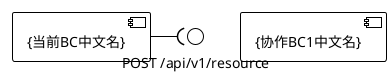

# 服务契约 — {限界上下文中文名}

## 1. 限界上下文概述

## 2. 服务契约列表

## 3. 服务契约详细定义

### 3.1 {服务名称}

#### 序列图

[Mermaid 序列图 — 仅限界上下文级别]

#### API 定义

- **API名称**:
- **API定义**: operationName(RequestType): ResponseType
- **通信协议**: HTTP_METHOD /api/v1/resource（或 gRPC 方法签名 / 事件定义）

#### Request Format

{ "field1": "type", "field2": "type" }

#### Response Format

{ "status": "success|error", "data": {}, "message": "Optional message" }

---

## 4. 组件图（PlantUML）

